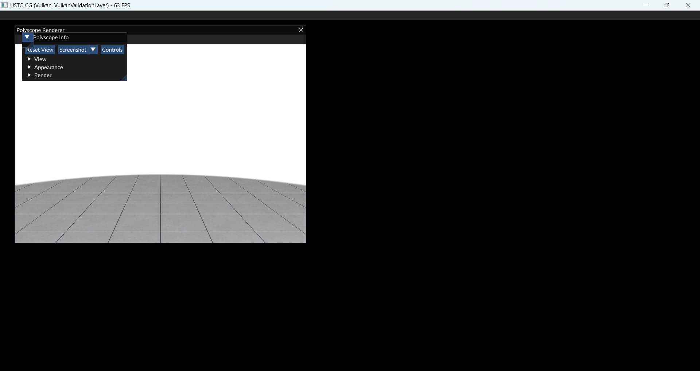
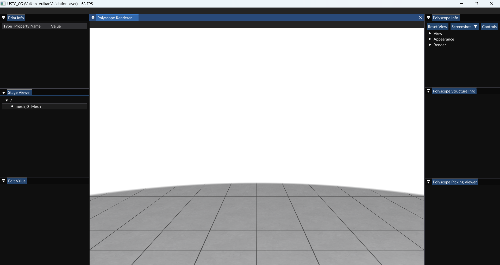
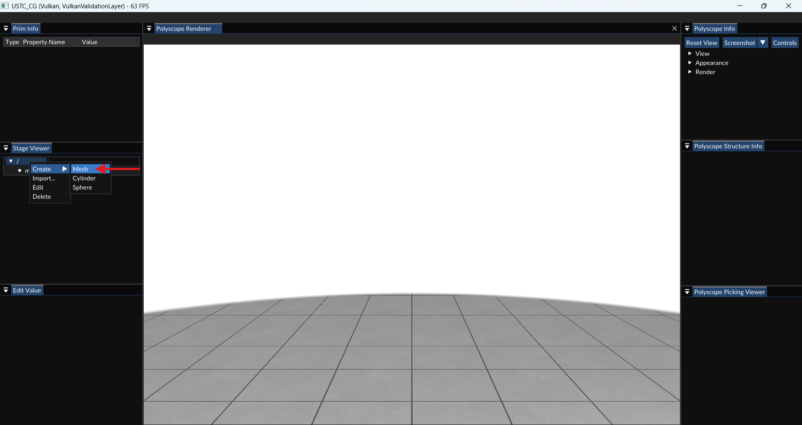
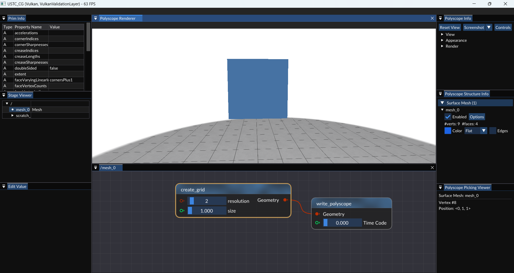

# DGP_2025
The assignments for the Digital Geometry Processing course for 2025, Spring.

# 作业目录 [点击跳转->](./assignments/README.md)

# 常见问题 [点击跳转->](./doc/FAQ.md)

# Build
首先执行git系列操作
```
git clone https://github.com/T7imal/DGP_2025.git
cd DGP_2025
git submodule update --init --recursive
```
然后安装下方依赖。

# Dependencies

## Windows + MSVC
强烈建议在Windows系统下使用本框架，并使用最新版MSVC进行构建和编译。

### Python 3.10.11 
[下载地址](https://www.python.org/downloads/release/python-31011/)

安装时无需勾选Debug库，需要加入path。

#### python依赖
PyOpenGL PySide6 numpy

推荐使用pip安装。

```
pip install PyOpenGL PySide6 numpy
```

### CMake 最新版本 (>3.31.5)
[下载地址](https://cmake.org/download/#latest)

### Vulkan SDK (为避免兼容性问题，使用1.3.296版本) (**方法2必须**)
[下载地址](https://vulkan.lunarg.com/sdk/home)

### 其他依赖

本框架依赖于OpenUSD和slang，你有两种方式来构建依赖

1. 打开终端。如果你在使用Windows，打开VS附带的**Developer PowerShell for VS 2022**，以确保默认使用的编译器是MSVC。在开始构建前，你需要确保已安装最新版的CMake(>3.31.5)和Python3.10.11，并将其加入环境变量。输入以下命令以测试：

   ```shell
   python --version
   # 确保输出为Python 3.10.11
   
   cmake --version
   # 确保输出为CMake version 3.31.5

   echo $Env:VULKAN_SDK
   # 确保输出为Vulkan SDK的路径
   ```
 
   确保Python和CMake的版本正确后，将以下命令中的`path/to/DGP_2025`替换为你的实验框架目录，然后执行：

   ```shell
   # 移动到实验框架目录
   cd path/to/DGP_2025
   # 构建Debug模式依赖，你也可以将以下命令修改为python configure.py --all --build_variant Debug Release RelWithDebInfo，以构建全部模式依赖
   python configure.py --all --build_variant Debug
   ```

   以上的方法对网络要求较高，且耗时较长。构建完成后会占据很大的空间，可以删除`SDK/OpenUSD/Debug/build/`和`SDK/OpenUSD/Debug/src`文件夹以释放部分空间。

2. 如果你在使用Windows，可以直接下载提供的依赖库：https://rec.ustc.edu.cn/share/964f44c0-f347-11ef-a987-91f9b7ea5492 ，将其解压到当前文件夹，形如

   ```
   DGP_2025
   ├── SDK
   │   ├── OpenUSD
   │   └── slang
   └── ...
   ```

   然后打开终端，执行以下命令

   ```shell
   # 构建所有模式的依赖
   # 注意：运行后SDK文件夹内的内容将被修改，如需重新构建，请删除SDK、Binary文件夹，重新解压SDK.zip
   python configure.py --all --copy-only --build_variant Debug Release RelWithDebInfo
   ```

最后用编辑器/IDE打开文件夹，或cmake后打开sln文件即配置完成

-   例如，你可以用已经配置好CMake插件的VS Code打开文件夹，并将CMake插件中的编译器设置为MSVC(如Visual Studio Community 2022 - amd64)。

-   你也可以直接用VS打开文件夹，VS会自动进行CMake操作。当CMake操作完成后，就可以在屏幕上方的下拉菜单选择启动项，选择`USTC_CG_polyscope_test`即可点击调试运行。

-   你也可以用CMake Gui打开文件夹，选择生成文件夹为`build`，选择MSVC编译器，点击Configure，然后点击Generate，生成的sln文件即可用VS打开。

-   你也可以在项目根目录打开终端，输入以下命令

    ```shell
    mkdir build # 创建build文件夹
    cd build # 进入build文件夹
    cmake .. # 生成sln文件
    ```

    然后用VS打开build文件夹下的sln文件即可。

    如果你不想打开VS编译，你也可以用命令行编译：

    ```shell
    # 在build文件夹下
    cmake --build . --config Debug
    ```

    如果你想编译Release版本，将`Debug`替换为`Release`即可。


## Mac (macOS Catalina) + Homebrew + Xcode
App Store 下载Xcode安装
运行命令
```Terminal
sudo xcode-select -s /Applications/Xcode.app/Contents/Developer 
```

### Python 3.10.11 
```Terminal
brew install pyenv
pyenv install 3.10.11
pyenv global 3.10.11   # 全局设置为3.10.11版本
```

Terminal 设置
```Terminal
echo 'eval "$(pyenv init -)"' >> ~/.zshrc  # 如果你使用zsh
echo 'eval "$(pyenv init -)"' >> ~/.bash_profile  # 如果你使用bash
source ~/.zshrc  # 或 source ~/.bash_profile
```

### CMake 最新版本 (>=3.31.5)
[下载地址](https://cmake.org/download/#latest)
```Terminal
brew install cmake
```

### ninja 安装
```Terminal
brew install ninja
```

### vulkan 安装 (为避免兼容性问题，使用1.3.296版本)
[下载地址](https://vulkan.lunarg.com/sdk/home)

确保Python和CMake的版本正确
python --version
# 确保输出为Python 3.10.11
```
pip install pyside6 pyopengl jinja2 -i https://pypi.mirrors.ustc.edu.cn/simple/    # 必须安装
cmake --version
# 确保输出为CMake version>=3.31.5
```

将以下命令中的`path/to/DGP_2025`替换为你的实验框架目录，然后执行：
```Terminal
# 移动到实验框架目录
cd path/to/DGP_2025
# 构建Debug模式依赖，你也可以将以下命令修改为python configure.py --all --build_variant Debug Release RelWithDebInfo，以构建全部模式依赖
python configure.py --all --build_variant Debug
```
在构建依赖过程中python可能会缺少一些安装包，通过 pip install ... 安装后再次构建依赖即可

## 使用方法简介
打开项目并编译后，运行`USTC_CG_polyscope_test`项目（可执行文件位于`Binaries/Debug`下），可以看到其中包含数个窗口，堆叠在右上角。如图所示：



第一次启动时，需要自行整理窗口布局，例如：



右击下图箭头位置“/”处，选择“Create/Mesh”即可创建一个名为`mesh_0`的目录。如图所示：



右击`mesh_0`，选择“Edit”即可打开节点编辑窗口。右击节点编辑窗口，选择并添加节点，例如通过`create_grid`和`write_polyscope`即可创建一个yz平面上的网格，并显示在`Polyscope Renderer`窗口中，转动视角即可看到网格，如图所示：


