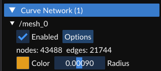
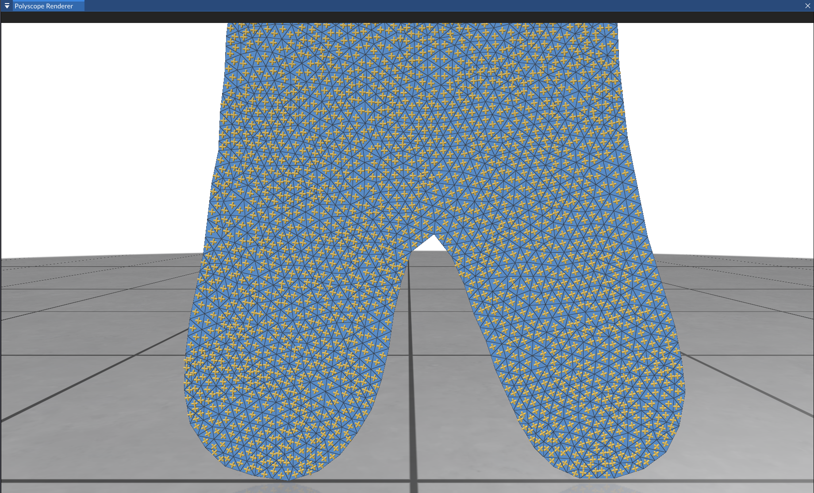

> Mario Botsch and Leif Kobbelt. 
> 
> 2004. 
> 
> A remeshing approach to multiresolution modeling. 
> 
> In Proceedings of the 2004 Eurographics/ACM SIGGRAPH symposium on Geometry processing (SGP '04). 
> 
> Association for Computing Machinery, New York, NY, USA, 185–192. 
> 
> https://doi.org/10.1145/1057432.1057457

> Olga Diamanti, Amir Vaxman, Daniele Panozzo, and Olga Sorkine-Hornung. 
> 
> 2014. 
> 
> Designing N-PolyVector Fields with Complex Polynomials. 
> 
> Comput. Graph. Forum 33, 5 (August 2014), 1–11.

> https://doi.org/10.1111/cgf.12426

## 实验步骤

### 1. Git 拉取仓库更新

对于一般的Git仓库，只需执行`git pull`命令，即可拉取仓库最新的更新。

然而，本实验框架仓库是包含子模块(`git submodule`)的目录，执行`git pull`后，只会更新直接包含在仓库中的文件，而不会更新仓库的子模块。

如果要确保仓库中所有内容都最新，需要在拉取后，再更新子模块。命令如下：

```shell
git pull    # 拉取仓库更新
git submodule update --init --recursive    # 更新子模块
```

这里提供一种更方便的方式。以下命令可以为给git添加一个新命令`git pullall`，执行该命令时，会自动拉取仓库更新并更新子模块。

```shell
git config --global alias.pullall '!f(){ git pull "$@" && git submodule update --init --recursive; }; f'
```

执行完上述命令后，只需执行

```shell
git pullall
```

即可拉取仓库更新并更新子模块。

### 2. 编译运行

拉取完成后，使用CMake配置项目的同学，最好重新执行一次CMake，以确保新添加的文件被正确添加到项目中。

使用VS文件夹模式打开项目的同学，可以直接重新用VS打开，VS会自动重新进行CMake配置。

打开VS之后，按下`Ctrl+Shift+B`完整编译项目，然后按下`F5`运行项目即可。

**万一出现无法正确运行的问题，尝试“生成”-“重新生成解决方案”/“全部重新生成”。**

### 3. 实现平均值坐标的计算

你需要根据论文的内容，完成`source/Editor/geometry_nodes/cross_field.h`中包含`TODO`的部分，其中包含关于算法过程的注释。

可视化时，需要减小曲线半径，才能看清。



左脚、右脚和身体部分的Cross Field角度不同，但平滑过渡。



### 4. 测试

将`assignment/assignment10`目录下的`stage.usdc`文件放到`Assets`目录下，然后运行程序，可以看到`Stage Viewer`窗口中出现了`mesh_0`和`mesh_1`项，右击`mesh_0`项，选择`Edit`打开节点编辑器后，所有节点自动由下向上计算，将网格显示在`Polyscope Renderer`窗口中。然后，在`Polyscope Structure Info`窗口中调整`mesh_0`（实际上是节点曲线）的半径，调整到大约为$0.001$时，即可看出Cross Field的效果。


## 实验提交

将`cross_field.h`打包为 `zip` 文件，并将其命名为 `学号_姓名_hw10.zip`，通过邮件发送至 `hwc20040629@mail.ustc.edu.cn`，在邮件主题中注明课程名称、作业序号和学号、姓名。
