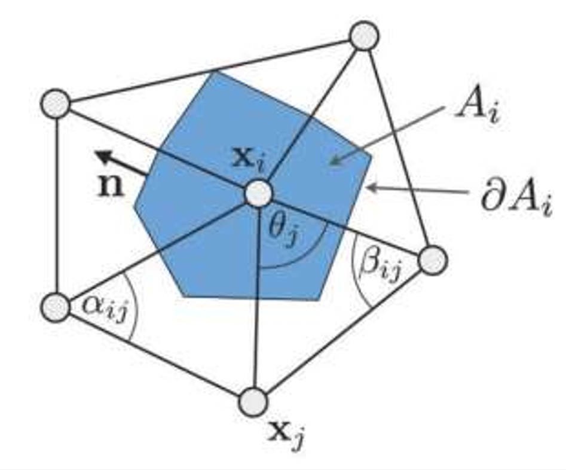
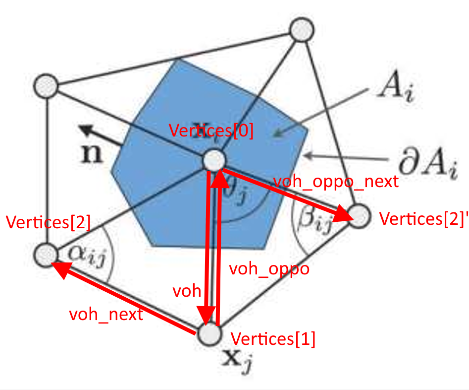
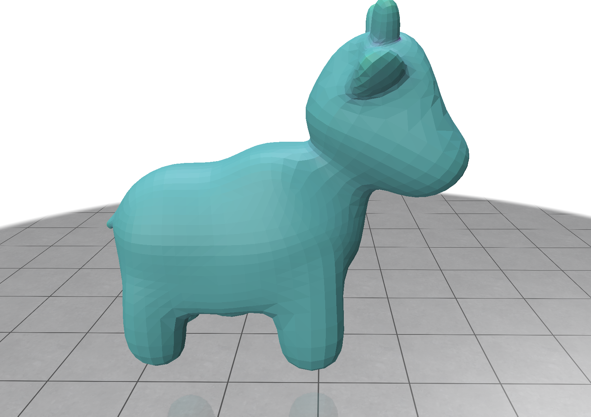
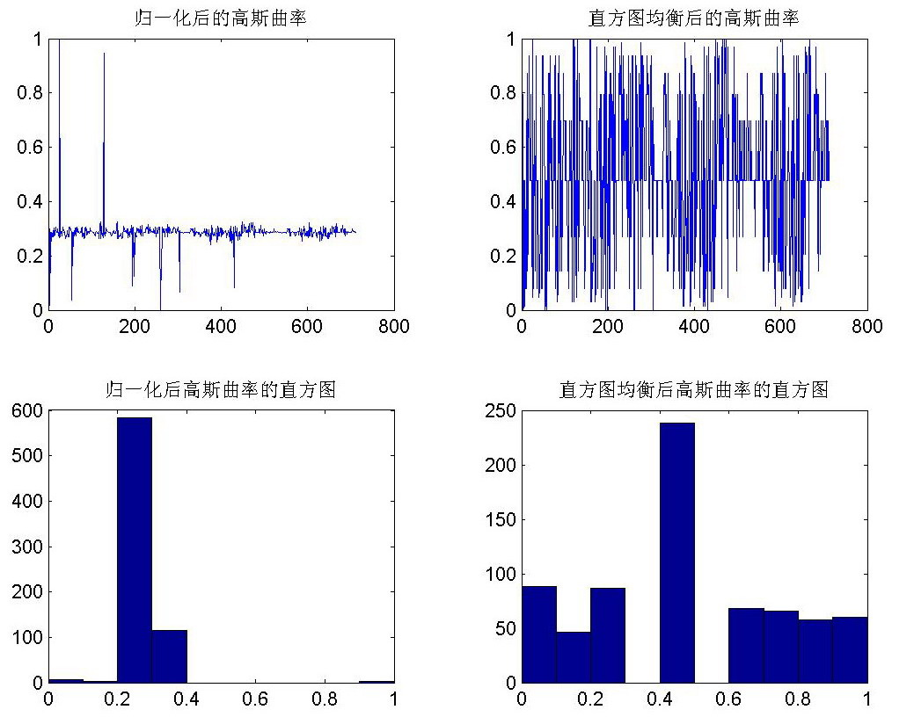
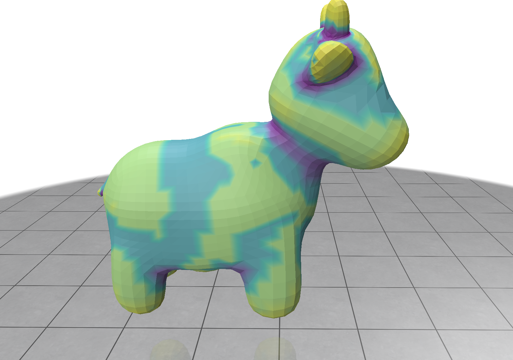

# 作业二分析

## 离散曲面上的平均曲率

在离散曲面上，平均曲率的计算通常基于离散Laplace-Beltrami算子。对于顶点 v_i，其Laplace-Beltrami算子可表示为：

$$
\Delta \mathbf{x}(v_i) = \frac{1}{2A_i} \sum_{j \in \mathcal{N}(i)} (\cot(\alpha_{ij})+\cot(\beta_{ij})) (\mathbf{x}_j - \mathbf{x}_i)
$$

其中：
- $A_i$ 是顶点 $v_i$ 周围的混合面积（通常为相邻三角形面积之和的1/3）
- $\mathcal{N}(i)$ 表示与顶点 $v_i$ 相邻的顶点集合
- $\alpha_{ij}$ 和 $\beta_{ij}$ 是边 $(i,j)$ 两侧的对角
- $\mathbf{x}_j$ 和 $\mathbf{x}_i$ 是顶点的位置向量

如图所示：



平均曲率的定义为Laplace-Beltrami算子的模长的一半，符号由法向量决定：

$$ 
\left|H\right| = \frac{1}{2} \left|\Delta \mathbf{x}(v_i)\right|
$$

$$
H = -\frac{1}{2} \Delta \mathbf{x}(v_i) \cdot \mathbf{n}_i = \frac{1}{2A_i} \sum_{j \in \mathcal{N}(i)} (\cot(\alpha_{ij})+\cot(\beta_{ij})) (\mathbf{x}_i - \mathbf{x}_j) \cdot \mathbf{n}_i
$$

其中 $\mathbf{n}_i$ 是顶点 $v_i$ 处的单位法向量。

**代码实现**：

首先，由于本次作业框架中，创建OpenMesh网格时没有请求法向量，导致无法计算平均曲率的符号，向同学们表示抱歉。

为了计算符号，需要在`NODE_EXECUTION_FUNCTION(mean_curvature)`中请求法向量：

```cpp
// Request vertex and face normals
omesh.request_vertex_normals();
omesh.request_face_normals();
omesh.update_normals();
```

然后就可以在`compute_mean_curvature`函数中正确计算平均曲率了：

```cpp
void compute_mean_curvature(
    const MyMesh& omesh,
    pxr::VtArray<float>& mean_curvature)
{
    // TODO: Implement the mean curvature computation
    //  You need to fill in `mean_curvature`

    mean_curvature.resize(omesh.n_vertices());
    for (auto v_it = omesh.vertices_begin(); v_it != omesh.vertices_end();
         ++v_it) {
        auto vertex_handle = *v_it;
        // 计算顶点周围三角形的Laplace-Beltrami Operator
        auto laplace = MyMesh::Point(0.0f, 0.0f, 0.0f);

        // 遍历由顶点出发的半边
        for (auto voh_it = omesh.cvoh_iter(vertex_handle); voh_it.is_valid();
             ++voh_it) {
            auto he_handle = *voh_it;

            std::vector<MyMesh::Point> face_vertices;
            face_vertices.resize(3);
            float cot_sum = 0.0f;

            // 先计算一侧的面
            // 求出该边对应的面的三个顶点坐标，我们需要求的是face_vertices[2]处的cotangent
            if (!omesh.is_boundary(he_handle)) {
                face_vertices[0] =
                    omesh.point(omesh.from_vertex_handle(he_handle));
                face_vertices[1] =
                    omesh.point(omesh.to_vertex_handle(he_handle));
                face_vertices[2] =
                    omesh.point(omesh.to_vertex_handle(he_handle.next()));
                float cos_1 = OpenMesh::dot(
                    (face_vertices[0] - face_vertices[2]).normalize(),
                    (face_vertices[1] - face_vertices[2]).normalize());
                float cot_1 = cos_1 / sqrt(1 - cos_1 * cos_1);
                cot_sum += cot_1;
            }

            // 计算另一侧的面
            // 求出该边对应的面的三个顶点坐标，我们需要求的是face_vertices[2]处的cotangent
            auto he_handle_oppo = omesh.opposite_halfedge_handle(he_handle);
            if (!omesh.is_boundary(he_handle_oppo)) {
                face_vertices[0] =
                    omesh.point(omesh.from_vertex_handle(he_handle_oppo));
                face_vertices[1] =
                    omesh.point(omesh.to_vertex_handle(he_handle_oppo));
                face_vertices[2] =
                    omesh.point(omesh.to_vertex_handle(he_handle_oppo.next()));
                float cos_2 = OpenMesh::dot(
                    (face_vertices[0] - face_vertices[2]).normalize(),
                    (face_vertices[1] - face_vertices[2]).normalize());
                float cot_2 = cos_2 / sqrt(1 - cos_2 * cos_2);
                cot_sum += cot_2;
            }

            // 求和
            MyMesh::Point edge_vector =
                omesh.point(vertex_handle) -
                omesh.point(omesh.to_vertex_handle(he_handle));
            laplace += cot_sum * edge_vector;
        }
        // 计算面积
        float area = 0.0f;
        for (auto vf_it = omesh.cvf_iter(vertex_handle); vf_it.is_valid();
             ++vf_it) {
            auto face_handle = *vf_it;
            area += omesh.calc_face_area(face_handle);
        }
        area /= 3.0f;  // 平均面积

        laplace /= (2.0f * area);  // Laplace-Beltrami Operator

        // 计算平均曲率
        auto H = laplace.length() / 2.0f;

        // 确定符号
        auto normal = omesh.normal(vertex_handle);
        if (OpenMesh::dot(normal, laplace) < 0.0f) {
            H = -H;
        }
        mean_curvature[vertex_handle.idx()] = H;
    }
}
```



## 离散曲面上的高斯曲率

$$
K = \frac{1}{2A_i} (2\pi - \sum_{j \in \mathcal{N}(i)} \theta_{ij})
$$

其中：
- $A_i$ 是顶点 $v_i$ 周围的混合面积（通常为相邻三角形面积之和的1/3）
- $\mathcal{N}(i)$ 表示与顶点 $v_i$ 相邻的顶点集合
- $\theta_{ij}$ 表示边 $(v_i,v_j)$ 与下一条边 $(v_i,v_{j+1})$ 之间的夹角

代码实现：

```cpp
void compute_gaussian_curvature(
    const MyMesh& omesh,
    pxr::VtArray<float>& gaussian_curvature)
{
    // TODO: Implement the Gaussian curvature computation
    //  You need to fill in `gaussian_curvature`

    gaussian_curvature.resize(omesh.n_vertices());
    for (auto v_it = omesh.vertices_begin(); v_it != omesh.vertices_end();
         ++v_it) {
        auto vertex_handle = *v_it;

        // 计算顶点周围三角形的角度和
        float angle_sum = 0.0f;
        // 遍历顶点的相邻面
        for (auto vf_it = omesh.cvf_iter(vertex_handle); vf_it.is_valid();
             ++vf_it) {
            auto face_handle = *vf_it;
            // 获取面上的顶点
            auto fv_it = omesh.cfv_iter(face_handle);
            auto v_0 = *fv_it++;
            auto v_1 = *fv_it++;
            auto v_2 = *fv_it++;

            // 计算角度
            if (vertex_handle == v_0) {
                auto edge1 = omesh.point(v_1) - omesh.point(v_0);
                auto edge2 = omesh.point(v_2) - omesh.point(v_0);
                angle_sum +=
                    acos(OpenMesh::dot(edge1.normalize(), edge2.normalize()));
            }
            else if (vertex_handle == v_1) {
                auto edge1 = omesh.point(v_0) - omesh.point(v_1);
                auto edge2 = omesh.point(v_2) - omesh.point(v_1);
                angle_sum +=
                    acos(OpenMesh::dot(edge1.normalize(), edge2.normalize()));
            }
            else if (vertex_handle == v_2) {
                auto edge1 = omesh.point(v_0) - omesh.point(v_2);
                auto edge2 = omesh.point(v_1) - omesh.point(v_2);
                angle_sum +=
                    acos(OpenMesh::dot(edge1.normalize(), edge2.normalize()));
            }
        }
        // 计算角度差
        float angle_defect = 2.0f * M_PI;
        if (omesh.is_boundary(vertex_handle)) {
            angle_defect = M_PI;
        }
        angle_defect -= angle_sum;

        // 计算面积
        float area = 0.0f;
        for (auto vf_it = omesh.cvf_iter(vertex_handle); vf_it.is_valid();
             ++vf_it) {
            auto face_handle = *vf_it;
            area += omesh.calc_face_area(face_handle);
        }
        area /= 3.0f;  // 平均面积

        gaussian_curvature[vertex_handle.idx()] =
            angle_defect / area;  // 高斯曲率 = 角度差 / 面积
    }
}
```

## 直方图均衡化

如果直接用上文计算出来的平均曲率和高斯曲率进行可视化，会导致图像对比度非常低，很难看出差异，如图所示



直方图均衡化的目的是将图像的直方图分布均匀化，使得图像的对比度更高。其基本思想是通过累积分布函数（CDF）来重新映射像素值，从而使得每个像素值在输出图像中出现的概率大致相等，如图所示（图片来源网络）：





直方图均衡化节点目前也已经加入框架内，其名字为`histogram_equalization`，它在不影响原数据范围的情况下进行均衡化。