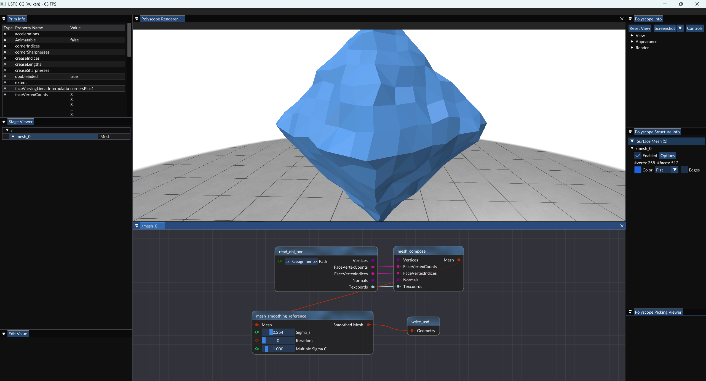
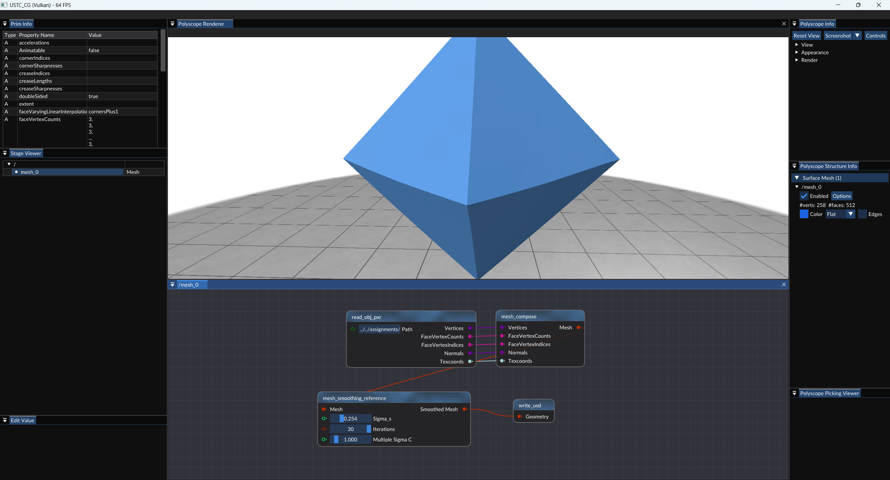

# 双边法向量滤波

> Y. Zheng, H. Fu, O. K. -C. Au and C. -L. Tai, "Bilateral Normal Filtering for Mesh Denoising," in IEEE Transactions on Visualization and Computer Graphics, vol. 17, no. 10, pp. 1521-1530, Oct. 2011, doi: 10.1109/TVCG.2010.264.
> 
> Abstract: Decoupling local geometric features from the spatial location of a mesh is crucial for feature-preserving mesh denoising. This paper focuses on first order features, i.e., facet normals, and presents a simple yet effective anisotropic mesh denoising framework via normal field denoising. Unlike previous denoising methods based on normal filtering, which process normals defined on the Gauss sphere, our method considers normals as a surface signal defined over the original mesh. This allows the design of a novel bilateral normal filter that depends on both spatial distance and signal distance. Our bilateral filter is a more natural extension of the elegant bilateral filter for image denoising than those used in previous bilateral mesh denoising methods. Besides applying this bilateral normal filter in a local, iterative scheme, as common in most of previous works, we present for the first time a global, noniterative scheme for an isotropic denoising. We show that the former scheme is faster and more effective for denoising extremely noisy meshes while the latter scheme is more robust to irregular surface sampling. We demonstrate that both our feature-preserving schemes generally produce visually and numerically better denoising results than previous methods, especially at challenging regions with sharp features or irregular sampling.
> 
> keywords: {Noise reduction;Noise;Mathematical model;Equations;Optimization;Laplace equations;Robustness;Mesh denoising;bilateral normal filtering;feature preserving;irregular surface sampling.},
> 
> URL: https://ieeexplore.ieee.org/stamp/stamp.jsp?tp=&arnumber=5674028&isnumber=5976480


## 实验步骤

### 1. Git 拉取仓库更新

对于一般的Git仓库，只需执行`git pull`命令，即可拉取仓库最新的更新。

然而，本实验框架仓库是包含子模块(`git submodule`)的目录，执行`git pull`后，只会更新直接包含在仓库中的文件，而不会更新仓库的子模块。

如果要确保仓库中所有内容都最新，需要在拉取后，再更新子模块。命令如下：

```shell
git pull    # 拉取仓库更新
git submodule update --init --recursive    # 更新子模块
```

这里提供一种更方便的方式。以下命令可以为给git添加一个新命令`git pullall`，执行该命令时，会自动拉取仓库更新并更新子模块。

```shell
git config --global alias.pullall '!f(){ git pull "$@" && git submodule update --init --recursive; }; f'
```

执行完上述命令后，只需执行

```shell
git pullall
```

即可拉取仓库更新并更新子模块。

### 2. 编译运行

拉取完成后，使用CMake配置项目的同学，最好重新执行一次CMake，以确保新添加的文件被正确添加到项目中。

使用VS文件夹模式打开项目的同学，可以直接重新用VS打开，VS会自动重新进行CMake配置。

打开VS之后，按下`Ctrl+Shift+B`完整编译项目，然后按下`F5`运行项目即可。

**万一出现无法正确运行的问题，尝试“生成”-“重新生成解决方案”/“全部重新生成”。**

### 3. 实现双边法向量滤波算法，实现网格去噪

你需要根据论文的内容，实现`source/Editor/geometry_nodes/node_mesh_smoothing.cpp`中所有带有`TODO`的函数。其中部分函数给出了一部分实现，你需要在此基础上完成剩余的部分。

### 4.测试网格降噪

将`assignment/assignment2`目录下的`satge.usdc`文件放到`Assets`目录下，然后运行程序，可以看到`Stage Viewer`窗口中出现了`mesh_0`项，右击`mesh_0`项，选择`Edit`打开节点编辑器后，所有节点自动由下向上计算，将降噪后的网格显示在`Polyscope Renderer`窗口中。你可以调整`Mesh Smoothing`节点的参数，观察不同参数下的降噪效果。如下图所示，其中`Iterations=0`表示不进行迭代，即原始模型，`Iterations=30`表示迭代30次。





可见，经过双边法向量滤波后，网格的噪声得到了有效的去除。

## 实验提交

将`node_mesh_smoothing.cpp`打包为 `zip` 文件，并将其命名为 `学号_姓名_hw3.zip`，通过邮件发送至 `hwc20040629@mail.ustc.edu.cn`，在邮件主题中注明课程名称、作业序号和学号、姓名。


