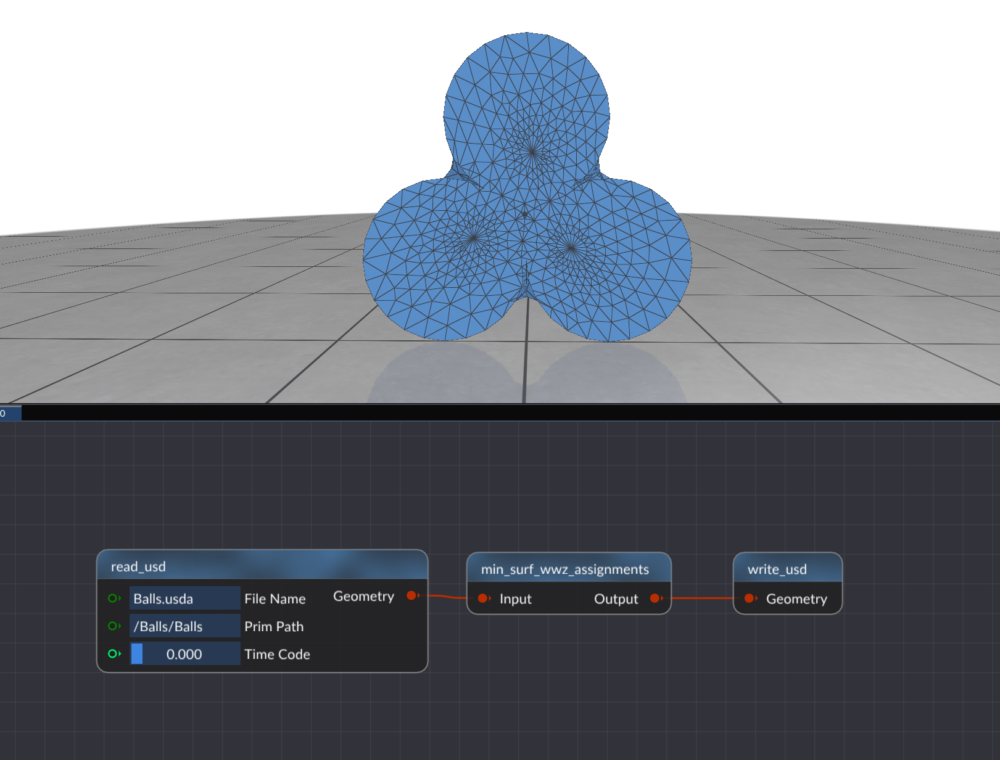

# Tutte's Embedding

> Michael S. Floater,
> Parametrization and smooth approximation of surface triangulations,
> Computer Aided Geometric Design,
> Volume 14, Issue 3,
> 1997,
> Pages 231-250,
> ISSN 0167-8396,
> https://doi.org/10.1016/S0167-8396(96)00031-3.
> (https://www.sciencedirect.com/science/article/pii/S0167839696000313)
> Abstract: A method based on graph theory is investigated for creating global parametrizations for surface triangulations for the purpose of smooth surface fitting. The parametrizations, which are planar triangulations, are the solutions of linear systems based on convex combinations. A particular parametrization, called shape-preserving, is found to lead to visually smooth surface approximations.
> Keywords: Surface triangulations; Approximation; Parametrization; Planar graphs; Straight-line drawing


## 实验步骤

### 1. Git 拉取仓库更新

对于一般的Git仓库，只需执行`git pull`命令，即可拉取仓库最新的更新。

然而，本实验框架仓库是包含子模块(`git submodule`)的目录，执行`git pull`后，只会更新直接包含在仓库中的文件，而不会更新仓库的子模块。

如果要确保仓库中所有内容都最新，需要在拉取后，再更新子模块。命令如下：

```shell
git pull    # 拉取仓库更新
git submodule update --init --recursive    # 更新子模块
```

这里提供一种更方便的方式。以下命令可以为给git添加一个新命令`git pullall`，执行该命令时，会自动拉取仓库更新并更新子模块。

```shell
git config --global alias.pullall '!f(){ git pull "$@" && git submodule update --init --recursive; }; f'
```

执行完上述命令后，只需执行

```shell
git pullall
```

即可拉取仓库更新并更新子模块。

### 2. 编译运行

拉取完成后，使用CMake配置项目的同学，最好重新执行一次CMake，以确保新添加的文件被正确添加到项目中。

使用VS文件夹模式打开项目的同学，可以直接重新用VS打开，VS会自动重新进行CMake配置。

打开VS之后，按下`Ctrl+Shift+B`完整编译项目，然后按下`F5`运行项目即可。

**万一出现无法正确运行的问题，尝试“生成”-“重新生成解决方案”/“全部重新生成”。**

### 3. 实现Tutte Embedding算法

你需要根据论文的内容，以及代码中的注释（其中包含Tutte Embedding算法介绍），完成`source/Editor/geometry_nodes/node_tutte.cpp`中带有`TODO`的函数。

本次作业只需要在固定原始网格边界的情况下进行Tutte Embedding，无需进行边界映射。

### 4. 测试Tutte Embedding算法

将`assignment/assignment4`目录下的`stage.usdc`文件放到`Assets`目录下，然后运行程序，可以看到`Stage Viewer`窗口中出现了`mesh_0`项，右击`mesh_0`项，选择`Edit`打开节点编辑器后，所有节点自动由下向上计算，将Tutte Embedding后的网格显示在`Polyscope Renderer`窗口中。正确的结果如图所示



## 实验提交

将`node_tutte.cpp`打包为 `zip` 文件，并将其命名为 `学号_姓名_hw4.zip`，通过邮件发送至 `hwc20040629@mail.ustc.edu.cn`，在邮件主题中注明课程名称、作业序号和学号、姓名。
