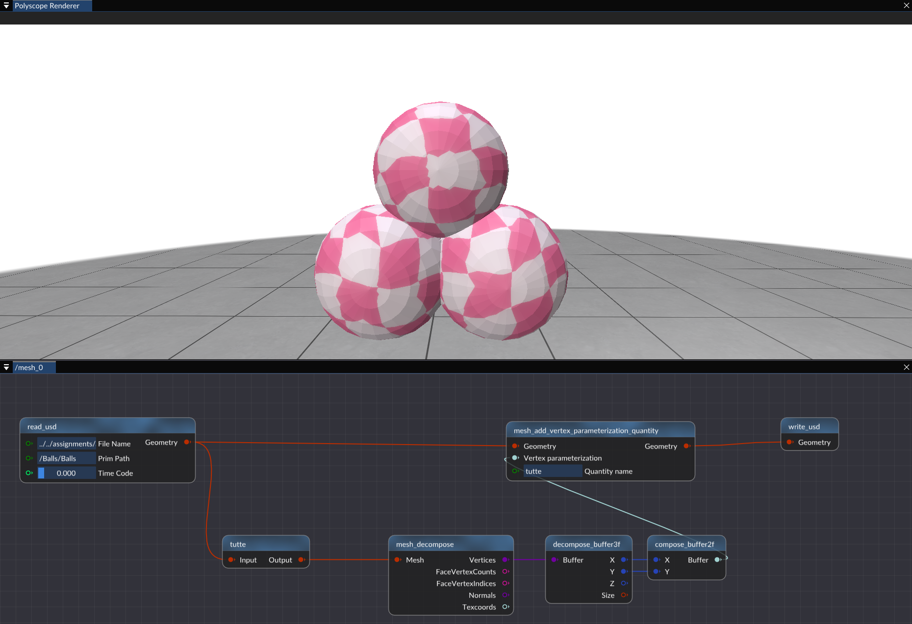
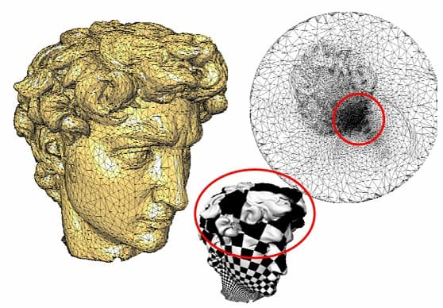
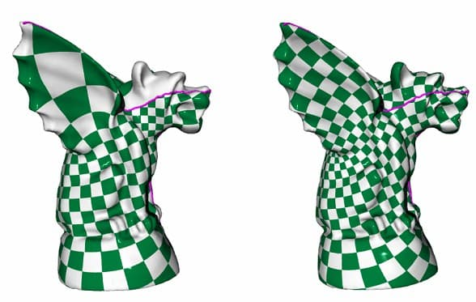
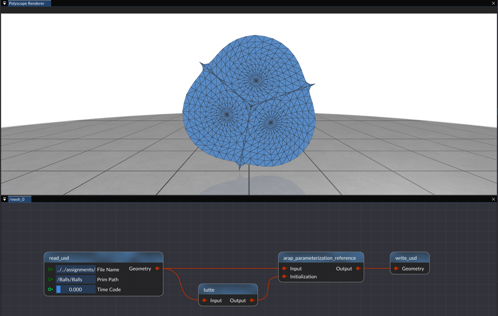
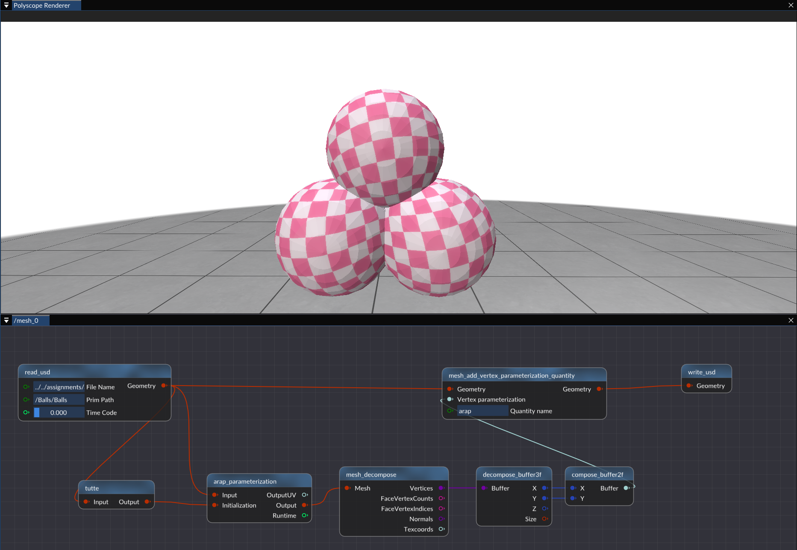

# ARAP Parameterization

> TY  - JOUR
>
> AU  - Liu, Ligang
>
> AU  - Zhang, Lei
>
> AU  - Xu, Yin
>
> AU  - Gotsman, Craig
>
> AU  - Gortler, Steven J.
>
> TI  - A Local/Global Approach to Mesh Parameterization
>
> JO  - Computer Graphics Forum
>
> VL  - 27
>
> IS  - 5
>
> SN  - 0167-7055
>
> UR  - https://doi.org/10.1111/j.1467-8659.2008.01290.x
>
> DO  - https://doi.org/10.1111/j.1467-8659.2008.01290.x
>
> SP  - 1495
>
> EP  - 1504
>
> KW  - I.3.5 [Computer Graphics]: Computational Geometry and Object Modeling I.3.8 [Computer Graphics]: Application
>
> PY  - 2008
>
> AB  - Abstract We present a novel approach to parameterize a mesh with disk topology to the plane in a shape-preserving manner. Our key contribution is a local/global algorithm, which combines a local mapping of each 3D triangle to the plane, using transformations taken from a restricted set, with a global ?stitch? operation of all triangles, involving a sparse linear system. The local transformations can be taken from a variety of families, e.g. similarities or rotations, generating different types of parameterizations. In the first case, the parameterization tries to force each 2D triangle to be an as-similar-as-possible version of its 3D counterpart. This is shown to yield results identical to those of the LSCM algorithm. In the second case, the parameterization tries to force each 2D triangle to be an as-rigid-as-possible version of its 3D counterpart. This approach preserves shape as much as possible. It is simple, effective, and fast, due to pre-factoring of the linear system involved in the global phase. Experimental results show that our approach provides almost isometric parameterizations and obtains more shape-preserving results than other state-of-the-art approaches. We present also a more general ?hybrid? parameterization model which provides a continuous spectrum of possibilities, controlled by a single parameter. The two cases described above lie at the two ends of the spectrum. We generalize our local/global algorithm to compute these parameterizations. The local phase may also be accelerated by parallelizing the independent computations per triangle.
>
> ER  - 


## 实验步骤

### 1. Git 拉取仓库更新

对于一般的Git仓库，只需执行`git pull`命令，即可拉取仓库最新的更新。

然而，本实验框架仓库是包含子模块(`git submodule`)的目录，执行`git pull`后，只会更新直接包含在仓库中的文件，而不会更新仓库的子模块。

如果要确保仓库中所有内容都最新，需要在拉取后，再更新子模块。命令如下：

```shell
git pull    # 拉取仓库更新
git submodule update --init --recursive    # 更新子模块
```

这里提供一种更方便的方式。以下命令可以为给git添加一个新命令`git pullall`，执行该命令时，会自动拉取仓库更新并更新子模块。

```shell
git config --global alias.pullall '!f(){ git pull "$@" && git submodule update --init --recursive; }; f'
```

执行完上述命令后，只需执行

```shell
git pullall
```

即可拉取仓库更新并更新子模块。

### 2. 编译运行

拉取完成后，使用CMake配置项目的同学，最好重新执行一次CMake，以确保新添加的文件被正确添加到项目中。

使用VS文件夹模式打开项目的同学，可以直接重新用VS打开，VS会自动重新进行CMake配置。

打开VS之后，按下`Ctrl+Shift+B`完整编译项目，然后按下`F5`运行项目即可。

**万一出现无法正确运行的问题，尝试“生成”-“重新生成解决方案”/“全部重新生成”。**

### 3. 实现ARAP Parameterization算法

在上次的作业（Tutte's Embedding）中，我们成功地将一个有一条边界的网格映射到一个平面上，于是，我们就可以使用平面上新的顶点位置的`x`和`y`坐标作为网格的UV坐标。



可是固定边界的参数化方法会导致三角形的形变较大。



而若不固定边界，令边界的点也有自由度进行移动，能减小三角形的形变量，从而得到更好的参数化结果（注意左上角的网格大小）。



你需要根据论文的内容，以及代码中的注释（其中包含ARAP Parameterization算法介绍），完成`source/Editor/geometry_nodes/node_arap_parameterization.cpp`中带有`TODO`的函数。

以下是部分实现思路：
  - **Step 1:** 获取一个**初始参数化**。
    - 使用你在作业 4 中实现的Tutte参数化结果
  - **Step 2:** 实现 ARAP 的**局部迭代步骤（Local Phase）**。
    - 在每个三角形 $t$ 上独立执行，相对简单
    - 实现一个二阶矩阵的 SVD 分解
    - 固定参数坐标 $u$，计算当前参数化 Jacobian $\boldsymbol{J} _ t$ 的局部正交逼近 $\boldsymbol{L} _ t$
  - **Step 3:** 实现 ARAP 的**全局迭代步骤（Global Phase）**。
    - 固定每个三角形上的 $\boldsymbol{L}_t$ ，更新参数坐标 $u$
    - 求解一个全局的稀疏线性方程组
    - 方程组的系数固定不变，只需要设置一次并**预分解**
  -  **Step 4:** 迭代若干次观察结果。

如图是由Tutte's Embedding的嵌入结果为初始参数化，经过ARAP Parameterization算法迭代后得到的结果。



### 4. 测试ARAP Parameterization算法

将`assignment/assignment5`目录下的`stage.usdc`文件放到`Assets`目录下，然后运行程序，可以看到`Stage Viewer`窗口中出现了`mesh_0`项，右击`mesh_0`项，选择`Edit`打开节点编辑器后，所有节点自动由下向上计算，将具有UV坐标的网格显示在`Polyscope Renderer`窗口中。在`Polyscope Structure Info`窗口中，找到`/mesh_0`项，选中`vp_arap`顶点参数化并显示即可。



## 实验提交

将`node_arap_parameterization.cpp`打包为 `zip` 文件，并将其命名为 `学号_姓名_hw4.zip`，通过邮件发送至 `hwc20040629@mail.ustc.edu.cn`，在邮件主题中注明课程名称、作业序号和学号、姓名。
