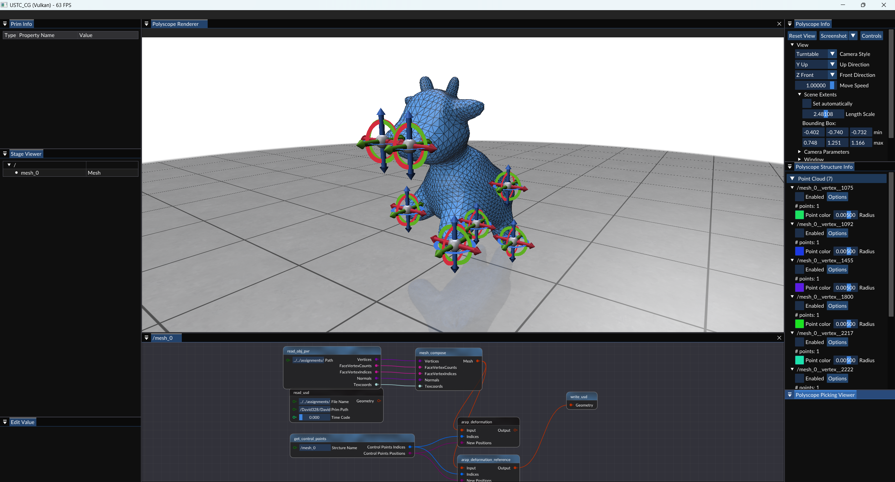

# ARAP Deformation

> Olga Sorkine and Marc Alexa. 
> 
> 2007. 
> 
> As-rigid-as-possible surface modeling. 
> 
> In Proceedings of the fifth Eurographics symposium on Geometry processing (SGP '07). 
> 
> Eurographics Association, Goslar, DEU, 109–116.
> 
> Abstract: Modeling tasks, such as surface deformation and editing, can be analyzed by observing the local behavior of the surface. We argue that defining a modeling operation by asking for rigidity of the local transformations is useful in various settings. Such formulation leads to a non-linear, yet conceptually simple energy formulation, which is to be minimized by the deformed surface under particular modeling constraints. We devise a simple iterative mesh editing scheme based on this principle, that leads to detail-preserving and intuitive deformations. Our algorithm is effective and notably easy to implement, making it attractive for practical modeling applications.


## 实验步骤

### 1. Git 拉取仓库更新

对于一般的Git仓库，只需执行`git pull`命令，即可拉取仓库最新的更新。

然而，本实验框架仓库是包含子模块(`git submodule`)的目录，执行`git pull`后，只会更新直接包含在仓库中的文件，而不会更新仓库的子模块。

如果要确保仓库中所有内容都最新，需要在拉取后，再更新子模块。命令如下：

```shell
git pull    # 拉取仓库更新
git submodule update --init --recursive    # 更新子模块
```

这里提供一种更方便的方式。以下命令可以为给git添加一个新命令`git pullall`，执行该命令时，会自动拉取仓库更新并更新子模块。

```shell
git config --global alias.pullall '!f(){ git pull "$@" && git submodule update --init --recursive; }; f'
```

执行完上述命令后，只需执行

```shell
git pullall
```

即可拉取仓库更新并更新子模块。

### 2. 编译运行

拉取完成后，使用CMake配置项目的同学，最好重新执行一次CMake，以确保新添加的文件被正确添加到项目中。

使用VS文件夹模式打开项目的同学，可以直接重新用VS打开，VS会自动重新进行CMake配置。

打开VS之后，按下`Ctrl+Shift+B`完整编译项目，然后按下`F5`运行项目即可。

**万一出现无法正确运行的问题，尝试“生成”-“重新生成解决方案”/“全部重新生成”。**

### 3. 实现ARAP Deformation算法

在上次的作业（ARAP Parameterization）中，我们发现ARAP 能量能够很好地反映网格的形变程度，最小化ARAP能量就能够让三角形的变形尽量小。ARAP也能够应用于网格变形。

你需要根据论文的内容，以及代码中的注释（其中包含ARAP Deformation算法介绍），完成`source/Editor/geometry_nodes/node_arap_deformation.cpp`中带有`TODO`的函数。

**以下思路中的公式部分与原论文有些许不同，仅供参考**

以下是部分实现思路：  
  - **Step 1:** 初始设置  
    - 构建余弦权重拉普拉斯矩阵 $L$  
    - 对每个控制顶点施加 Dirichlet 约束，使 $L(i,i)=1$  
  - **Step 2:** 预分解  
    - 使用 `Eigen::SparseLU` 对 $L$ 进行预分解，以便后续快速求解  
  - **Step 3:** 初始化变形  
    - 记录原始顶点位置 $P^0$（$n\times3$），并用 $P^0$ 初始化当前变形位置 $P$  
    - 将每个控制点 $P(\text{indices}[t])$ 直接设为 `new_positions[t]`  
  - **Step 4:** 局部–全局迭代  
    - **Local Phase**：对每个非控制顶点 $i$  
      - 计算协方差矩阵  
        $$
          C_i \;=\; \sum_{j\in N(i)} w_{ij}\,(P_i - P_j)\,(P^0_i - P^0_j)^{T}
        $$  
      - 对 $C_i$ 做 SVD，令  
        $$
          R_i = U\,V^{T}
        $$  
    - **Global Phase**：  
      - 构造右端向量 $\mathbf b_x,\mathbf b_y,\mathbf b_z$  
        - 控制点：$\mathbf b(i)=P(i,\ast)$  
        - 自由点：  
        $$
          \mathbf b(i)
          = \tfrac12 \sum_{j\in N(i)} w_{ij}\,(R_i + R_j)\,(P^0_i - P^0_j)
        $$  
      - 分别求解  
        $$
          L\,\mathbf u_x = \mathbf b_x,\quad
          L\,\mathbf u_y = \mathbf b_y,\quad
          L\,\mathbf u_z = \mathbf b_z
        $$  
      - 用解得的 $(u_x,u_y,u_z)$ 更新非控制点位置，并重新强制控制点坐标  
    - 重复上述局部和全局步骤，直到达到最大迭代次数或收敛  
  - **Step 5:** 写回结果  
    - 将最终的 $P$ 写回 `halfedge_mesh` 中的每个顶点坐标  


### 4. 测试ARAP Deformation算法

将`assignment/assignment6`目录下的`stage.usdc`文件放到`Assets`目录下，然后运行程序，可以看到`Stage Viewer`窗口中出现了`mesh_0`项，右击`mesh_0`项，选择`Edit`打开节点编辑器后，所有节点自动由下向上计算，将网格显示在`Polyscope Renderer`窗口中。

用**鼠标中键**点击网格的顶点（可以打开网格边显示方便选取顶点）后，就可以对顶点进行拖动。以选中的顶点作为控制点，拖动控制点，即可实现网格变形。建议多选几个控制点后进行拖动。



## 实验提交

将`node_arap_deformation.cpp`打包为 `zip` 文件，并将其命名为 `学号_姓名_hw6.zip`，通过邮件发送至 `hwc20040629@mail.ustc.edu.cn`，在邮件主题中注明课程名称、作业序号和学号、姓名。
