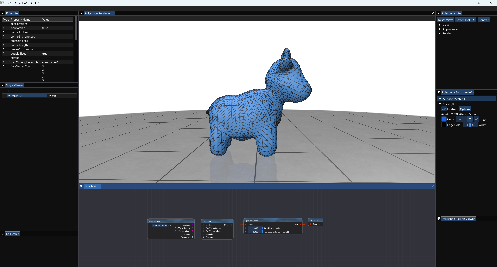
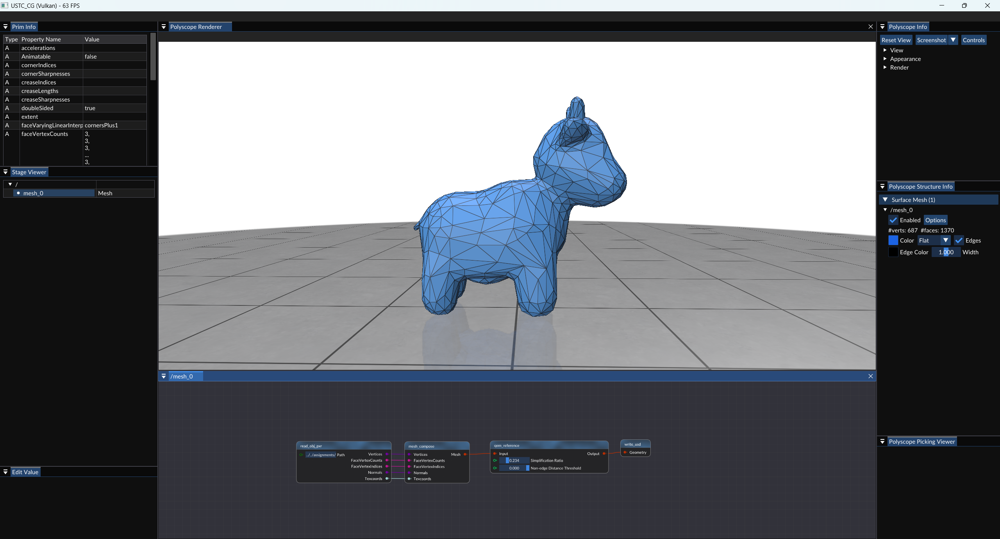

> Michael Garland and Paul S. Heckbert.
> 
> 1997.
> 
> Surface simplification using quadric error metrics.
>
> In Proceedings of the 24th annual conference on Computer graphics and interactive techniques (SIGGRAPH '97).
>
> ACM Press/Addison-Wesley Publishing Co., USA, 209–216.
>
> https://doi.org/10.1145/258734.258849

## 实验步骤

### 1. Git 拉取仓库更新

对于一般的Git仓库，只需执行`git pull`命令，即可拉取仓库最新的更新。

然而，本实验框架仓库是包含子模块(`git submodule`)的目录，执行`git pull`后，只会更新直接包含在仓库中的文件，而不会更新仓库的子模块。

如果要确保仓库中所有内容都最新，需要在拉取后，再更新子模块。命令如下：

```shell
git pull    # 拉取仓库更新
git submodule update --init --recursive    # 更新子模块
```

这里提供一种更方便的方式。以下命令可以为给git添加一个新命令`git pullall`，执行该命令时，会自动拉取仓库更新并更新子模块。

```shell
git config --global alias.pullall '!f(){ git pull "$@" && git submodule update --init --recursive; }; f'
```

执行完上述命令后，只需执行

```shell
git pullall
```

即可拉取仓库更新并更新子模块。

### 2. 编译运行

拉取完成后，使用CMake配置项目的同学，最好重新执行一次CMake，以确保新添加的文件被正确添加到项目中。

使用VS文件夹模式打开项目的同学，可以直接重新用VS打开，VS会自动重新进行CMake配置。

打开VS之后，按下`Ctrl+Shift+B`完整编译项目，然后按下`F5`运行项目即可。

**万一出现无法正确运行的问题，尝试“生成”-“重新生成解决方案”/“全部重新生成”。**

### 3. 实现平均值坐标的计算

你需要根据论文的内容，以及代码中的注释（其中包含QEM算法介绍），完成`source/Editor/geometry_nodes/node_qem.cpp`中包含`TODO`的部分。






#### 算法流程

1. 计算每个顶点的$Q$矩阵。

2. 预处理所有的合法点对，包括相邻顶点和距离非常近的不相邻顶点（可选），求出其收缩后的新顶点位置和收缩损失，存入以收缩损失排序的优先队列中。

3. 迭代以下操作，直到模型的面数小于目标面数：

    1. 从优先队列中取出损失最小的点对$(v_1,v_2)$，进行收缩操作，记新顶点为$v_{new}$。

    2. 计算新顶点$v_{new}$的$Q$矩阵，$Q_{new}=Q_1+Q_2$。

    3. 将优先队列中所有与$v_1$或$v_2$关联的点对$(v_1,u)$和$(v_2,u)$更新为$(v_{new},u)$，并重新计算新顶点位置和收缩损失，填入优先队列中。

#### 常见问题

OpenMesh中，删除顶点或面后，`mesh.n_vertices()`和`mesh.n_faces()`的值不会自动更新，只有当调用`mesh.garbage_collection()`后，才会更新。然而`mesh.garbage_collection()`会影响各种smart handle对应的内容，导致错误。因此我们建议：

- 在算法过程中不调用`mesh.garbage_collection()`。

- 使用以下方法来获得当前模型的面数：

    ```cpp
    int current_num_faces = 0;
    // faces_sbegin()只迭代未被删除的面
    for (auto sf_it = halfedge_mesh->faces_sbegin();
            sf_it != halfedge_mesh->faces_end();
            ++sf_it) {
        current_num_faces++;
    }
    ```

### 4. 测试

将`assignment/assignment8`目录下的`stage.usdc`文件放到`Assets`目录下，然后运行程序，可以看到`Stage Viewer`窗口中出现了`mesh_0`项，右击`mesh_0`项，选择`Edit`打开节点编辑器后，所有节点自动由下向上计算，将网格显示在`Polyscope Renderer`窗口中。调整


## 实验提交

将`node_qem.cpp`打包为 `zip` 文件，并将其命名为 `学号_姓名_hw8.zip`，通过邮件发送至 `hwc20040629@mail.ustc.edu.cn`，在邮件主题中注明课程名称、作业序号和学号、姓名。
