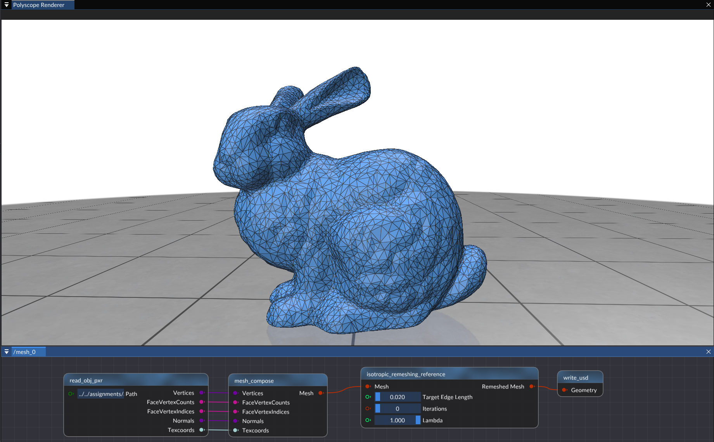
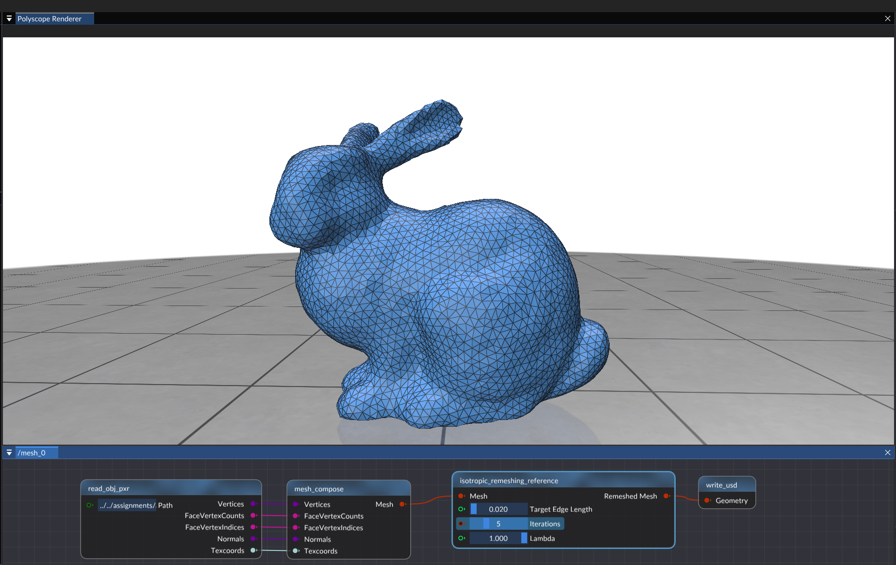
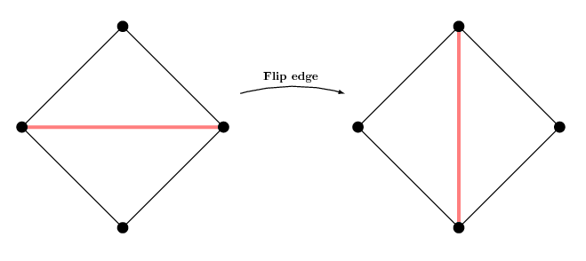

> Mario Botsch and Leif Kobbelt. 
> 
> 2004. 
> 
> A remeshing approach to multiresolution modeling. 
> 
> In Proceedings of the 2004 Eurographics/ACM SIGGRAPH symposium on Geometry processing (SGP '04). 
> 
> Association for Computing Machinery, New York, NY, USA, 185–192. 
> 
> https://doi.org/10.1145/1057432.1057457

## 实验步骤

### 1. Git 拉取仓库更新

对于一般的Git仓库，只需执行`git pull`命令，即可拉取仓库最新的更新。

然而，本实验框架仓库是包含子模块(`git submodule`)的目录，执行`git pull`后，只会更新直接包含在仓库中的文件，而不会更新仓库的子模块。

如果要确保仓库中所有内容都最新，需要在拉取后，再更新子模块。命令如下：

```shell
git pull    # 拉取仓库更新
git submodule update --init --recursive    # 更新子模块
```

这里提供一种更方便的方式。以下命令可以为给git添加一个新命令`git pullall`，执行该命令时，会自动拉取仓库更新并更新子模块。

```shell
git config --global alias.pullall '!f(){ git pull "$@" && git submodule update --init --recursive; }; f'
```

执行完上述命令后，只需执行

```shell
git pullall
```

即可拉取仓库更新并更新子模块。

### 2. 编译运行

拉取完成后，使用CMake配置项目的同学，最好重新执行一次CMake，以确保新添加的文件被正确添加到项目中。

使用VS文件夹模式打开项目的同学，可以直接重新用VS打开，VS会自动重新进行CMake配置。

打开VS之后，按下`Ctrl+Shift+B`完整编译项目，然后按下`F5`运行项目即可。

**万一出现无法正确运行的问题，尝试“生成”-“重新生成解决方案”/“全部重新生成”。**

### 3. 实现平均值坐标的计算

你需要根据论文的内容，完成`source/Editor/geometry_nodes/node_isotropic_remeshing.cpp`中包含`TODO`的部分。






#### 算法流程

算法流程位于论文第4节。记目标边长为$l$，则算法流程如下：

1. 对所有长度大于$\frac{4}{3}l$的边，在中点分裂，可以使用`mesh.split()`方法。
    - 注意：分裂后新生成四条边，也可能大于$\frac{4}{3}l$。
2. 对所有长度小于$\frac{4}{5}l$的边，将其两顶点合并至中点，可以使用`mesh.collapse()`方法。
    - 注意：遍历过程中，可能会出现顶点被删除的情况。
3. 对所有边，若翻转后能够使相关顶点的度数与目标差距更小（内部顶点为6，边界顶点为4），则翻转该边，可以使用`mesh.flip()`方法。
    - 三角形网格中，翻转边后，原边的两个顶点分别度数减少$1$，新边的两个顶点分别度数增加$1$。
    - 
4. 对所有顶点，用其相邻顶点加权计算“重力加权质心”（Gravity-Weighted Centroid），沿顶点切平面向该点移动。
    $$
    g_i = \frac{1}{\sum_{p_j \in N(p_i)} A_{p_j}} \sum_{p_j \in N(p_i)} A_{p_j} p_j
    $$

    $$
    p_i = p_i + \lambda \left( I - n_in_i^T \right) (g_i - p_i)
    $$
5. 迭代执行以上步骤。

#### 常见问题

我在实现的过程中，不知道为什么，OpenMesh提供的顶点法向计算函数`calc_vertex_normals()`计算出的法向量不正确，而顶点相邻边的法向都是正确的，非常奇怪，所以我只能自己实现了一个顶点法向计算函数。

### 4. 测试

将`assignment/assignment9`目录下的`stage.usdc`文件放到`Assets`目录下，然后运行程序，可以看到`Stage Viewer`窗口中出现了`mesh_0`项，右击`mesh_0`项，选择`Edit`打开节点编辑器后，所有节点自动由下向上计算，将网格显示在`Polyscope Renderer`窗口中。


## 实验提交

将`node_isotropic_remeshing.cpp`打包为 `zip` 文件，并将其命名为 `学号_姓名_hw9.zip`，通过邮件发送至 `hwc20040629@mail.ustc.edu.cn`，在邮件主题中注明课程名称、作业序号和学号、姓名。
